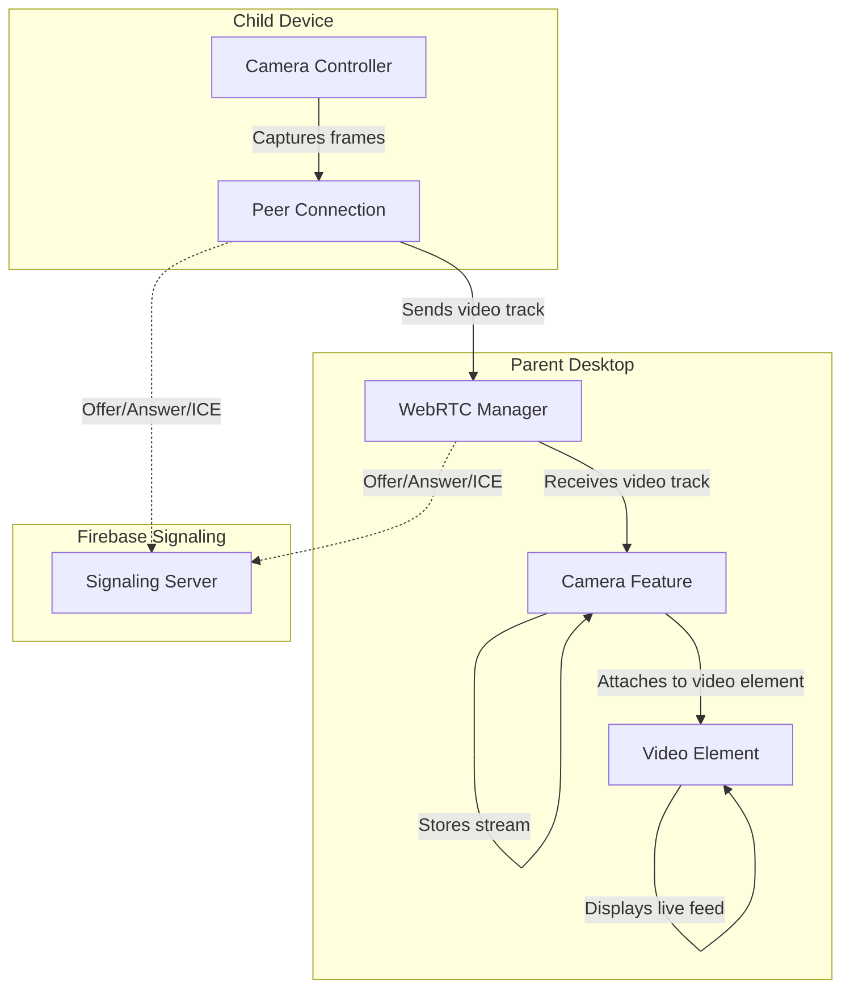
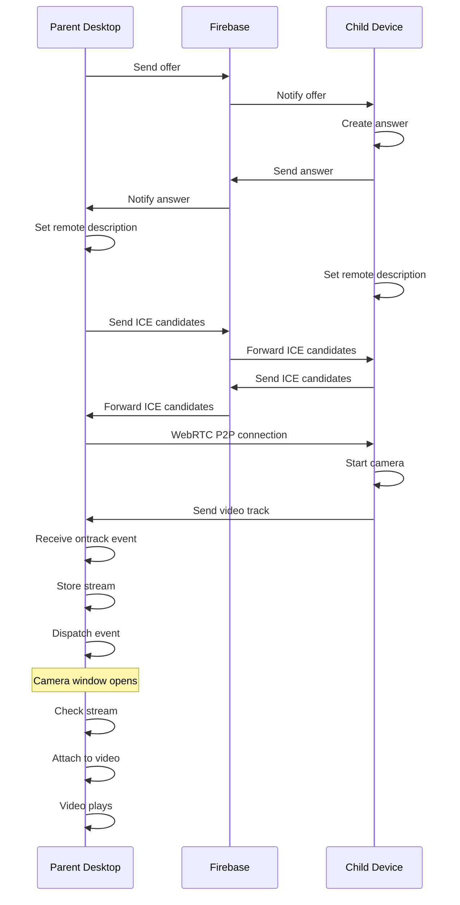

# Camera Feature

Real-time camera streaming from child device to parent desktop using WebRTC.

## Overview

The camera feature enables live video monitoring of the child device's camera. It uses native WebRTC for peer-to-peer streaming with minimal latency and no server-side video processing.

## Architecture

### Component Interaction Flow



### Data Flow Sequence



## File Structure

```
camera/
├── README.md              # This file
├── camera.js              # Main camera feature class
├── camera.html            # HTML template
├── camera.css             # Styling
└── camera-icon.svg        # Feature icon
```

## Components

### CameraFeature Class (`camera.js`)

Main controller for the camera feature.

**Constructor**
```javascript
new CameraFeature(container)
```
- `container`: DOM element where camera UI will be injected

**Key Methods**

| Method | Purpose |
|--------|---------|
| `init()` | Initialize feature, load template, setup listeners |
| `listenForStream()` | Check for existing stream or listen for new stream events |
| `attachStream(stream)` | Attach MediaStream to video element |
| `startCamera()` | Send CAMERA_ON command to child |
| `stopCamera()` | Send CAMERA_OFF command to child |
| `switchCamera()` | Send CAMERA_SWITCH command to child |
| `toggleCamera()` | Toggle between start/stop |
| `toggleFullscreen()` | Enter/exit fullscreen mode |
| `startRecording()` | Start recording camera feed (TODO) |
| `stopRecording()` | Stop recording (TODO) |

**Properties**

| Property | Type | Purpose |
|----------|------|---------|
| `container` | HTMLElement | Parent container for UI |
| `isStreaming` | boolean | Camera active state |
| `videoElement` | HTMLVideoElement | Video display element |
| `stream` | MediaStream | Current video stream |

### HTML Template (`camera.html`)

Provides the UI structure with:
- Header with recording controls
- Stream container with video element
- Bottom controls (play/pause, switch, fullscreen)
- Info display (resolution, FPS)

### Styling (`camera.css`)

Responsive design with:
- Glass-morphism effects
- Smooth animations
- Mobile-friendly controls
- Dark theme

## Stream Lifecycle

### 1. Connection Established
```
Parent sends offer → Child sends answer → WebRTC connection ready
```

### 2. User Interaction (Play Button)
```
User clicks play button → Shows loading spinner → Sends CAMERA_ON command
```

### 3. Child Processes Command
```
Child receives CAMERA_ON → Starts camera capture → Sends CAMERA_STARTED confirmation
```

### 4. Confirmation Received
```
Parent receives CAMERA_STARTED → Clears timeout → Hides spinner → Shows pause button
```

### 5. Video Track Sent
```
Child sends video track → Parent receives ontrack event → Stream stored in videoStreams
```

### 6. Stream Attached
```
Camera window already open → Feature checks for stream → Attaches to video element
```

### 7. Video Playing
```
Video element plays → User sees live feed
```

### 8. User Interaction (Pause Button)
```
User clicks pause button → Shows loading spinner → Sends CAMERA_OFF command
```

### 9. Child Stops Camera
```
Child receives CAMERA_OFF → Stops camera capture → Sends CAMERA_STOPPED confirmation
```

### 10. Confirmation Received
```
Parent receives CAMERA_STOPPED → Clears timeout → Hides spinner → Shows play button
```

## Integration Points

### With WebRTC Manager

The camera feature receives streams from `WebRTCManager`:

```javascript
// WebRTC Manager stores stream
this.videoStreams.camera = stream;

// Dispatches event
window.dispatchEvent(new CustomEvent('camera-stream-received', {
  detail: { stream }
}));
```

### With Connection Manager

Commands are sent via `ConnectionManager`:

```javascript
app.connectionManager.sendCommand('CAMERA_ON');
app.connectionManager.sendCommand('CAMERA_OFF');
app.connectionManager.sendCommand('CAMERA_SWITCH');
```

Confirmations are dispatched as custom events:

```javascript
// Connection manager dispatches when confirmation received
window.dispatchEvent(new CustomEvent('camera-confirmation', {
  detail: { message: 'CAMERA_STARTED' }
}));

// Camera feature listens for confirmations
window.addEventListener('camera-confirmation', (event) => {
  const message = event.detail.message;
  // Handle CAMERA_STARTED, CAMERA_STOPPED, CAMERA_SWITCHED
});
```

### With Window Manager

Camera window is created by `WindowManager`:

```javascript
windowManager.createWindow('camera');
```

## Commands

Commands sent to child device via data channel:

| Command | Purpose | Response | Timeout |
|---------|---------|----------|---------|
| `CAMERA_ON` | Start camera capture | `CAMERA_STARTED` | 30s |
| `CAMERA_OFF` | Stop camera capture | `CAMERA_STOPPED` | 30s |
| `CAMERA_SWITCH` | Switch between front/back | `CAMERA_SWITCHED` | 30s |

### Confirmation Flow

The camera feature uses a confirmation-based flow to ensure reliable command execution:

1. **User Action**: User clicks play/pause button
2. **Loading State**: Button shows animated spinner, becomes disabled
3. **Command Sent**: `CAMERA_ON` or `CAMERA_OFF` sent to child device
4. **Timeout Set**: 30-second timeout started (in case confirmation never arrives)
5. **Child Processes**: Child device executes command
6. **Confirmation Sent**: Child sends `CAMERA_STARTED` or `CAMERA_STOPPED`
7. **Event Dispatched**: Connection manager dispatches `camera-confirmation` event
8. **Timeout Cleared**: Confirmation timeout is cleared
9. **UI Updated**: Button spinner hidden, correct icon shown (play or pause)
10. **Button Enabled**: Button re-enabled for next interaction

### Error Handling

- **Timeout**: If confirmation doesn't arrive within 30 seconds, error message shown
- **Connection Lost**: If data channel closes, button returns to normal state
- **Invalid State**: Button disabled during loading to prevent duplicate commands

## Performance Considerations

### Latency
- **Typical**: 50-200ms (depends on network)
- **Factors**: Network quality, ICE candidate gathering, codec

### Bandwidth
- **Resolution**: 640x480 (configurable)
- **FPS**: 30 (configurable)
- **Bitrate**: ~500-1500 kbps (depends on quality)

### Optimization Tips
1. Use hardware video encoding on child device
2. Adjust resolution based on network conditions
3. Enable VP8/VP9 codecs for better compression
4. Monitor ICE connection state

## Troubleshooting

### No Video Feed
1. Check WebRTC connection is established
2. Verify child device has camera permission
3. Check browser console for errors
4. Ensure video element has `video-camera` class

### Laggy Video
1. Check network latency
2. Reduce resolution on child device
3. Check CPU usage on both devices
4. Verify codec is hardware-accelerated

### Audio Issues
- Audio is handled separately by microphone feature
- See `mic/README.md` for audio setup

## References

- [WebRTC API](https://developer.mozilla.org/en-US/docs/Web/API/WebRTC_API)
- [MediaStream API](https://developer.mozilla.org/en-US/docs/Web/API/MediaStream)
- [RTCPeerConnection](https://developer.mozilla.org/en-US/docs/Web/API/RTCPeerConnection)
