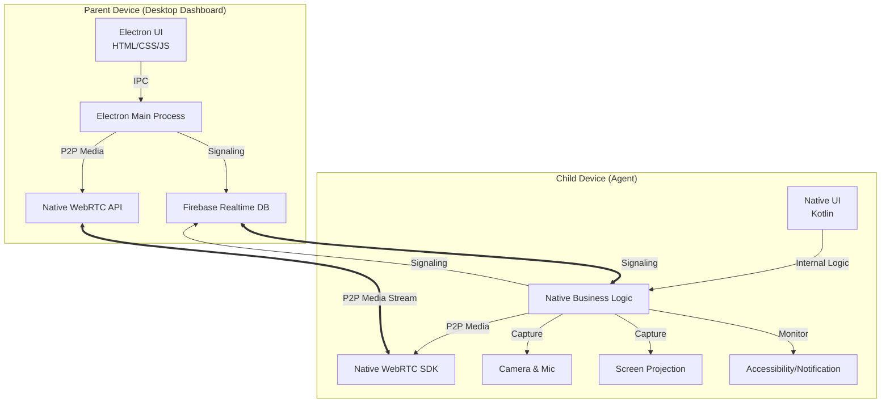
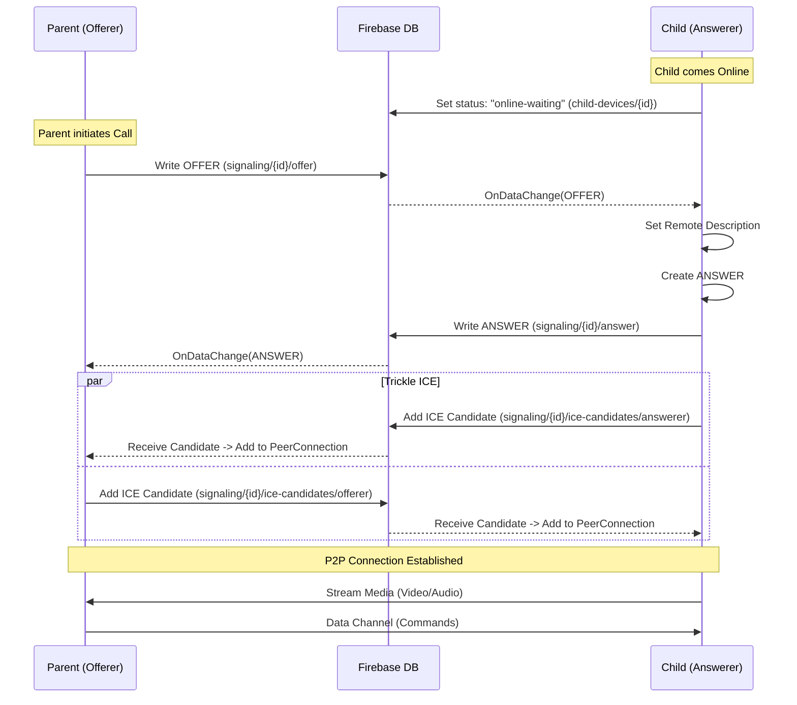

* **Name**: Nexus (*Nexus-parent & Nexus-child*)
* **Category**: Parental control monitoring system
* **Model**: Agent (child device) + Dashboard (parent device)
* **Target Platforms**:
  * **Agent**: Android-10+ & iOS
  * **Dashboard**:
    * Mobile: Android, iOS
    * Desktop: Windows, macOS, Linux
* **Core Objective**:
  * Providing parents a **comprehensive surveillance** over minor-owned devices.
  * With **minimal detectability and high survivability** against app/OS updates.
* **Global Constraints**:
  * **Binary size**: <100 MB per app (agent + dashboard, mobile + desktop).
  * **Performance**: Native-level execution on all critical paths.
  * **Maintenance**: Native implementation for Child, Electron for Desktop Parent.

## **Framework & Technology Strategy**

### System Architecture Overview

### Agent (Child Device)

* **Purpose**: data collection + enforcement
* **Architecture**: **Fully Native Implementation** (Kotlin for Android, Swift for iOS).
* **Why Native?**:
  * Maximizes stability and OS integration for background services.
  * Reduces binary size and memory footprint.
  * Ensures best performance for media capture (Camera2 API, MediaProjection).
* **Technology Stack**:
  * **Android**:
    * Language: Kotlin
    * WebRTC: `google-webrtc` native SDK
    * Signaling: Firebase Realtime Database (Native SDK)
    * Core: Android Services, BroadcastReceivers, ContentProviders
  * **iOS** (Planned):
    * Language: Swift
    * WebRTC: Native WebRTC framework
* **Signaling Schema**:
  * Path: `signaling/{deviceId}`
  * Protocol: Trickle ICE (Offer/Answer exchanged via DB, Candidates exchanged immediately).

### Dashboard (Parent Side)

* **Purpose**: control, analytics, visualization, command dispatch
* **Architecture**: Electron + Native WebRTC (no Rust core)
* **Why Electron?**:
  * Native WebRTC support (no custom decoders needed)
  * Cross-platform (Windows, macOS, Linux)
  * Faster development and iteration
  * Proven stability for desktop apps
* **Technology Stack**:
  * **Desktop**:
    * Platforms: Windows, macOS, Linux
    * Framework: Electron
    * UI: HTML/CSS/JavaScript
    * Backend: Node.js (Electron main process)
    * WebRTC: Native browser WebRTC API
    * Signaling: Firebase Realtime Database
* **Key Components**:
  * `src/main.js`: Electron main process (window management, IPC)
  * `dist/js/webrtc/webrtc-manager.js`: WebRTC connection management
  * `dist/js/managers/connection-manager.js`: Device connection logic
  * `dist/js/features/camera/camera.js`: Camera streaming feature
  * `dist/js/ipc-bridge.js`: Electron IPC communication

## **Signaling & Connection Flow**

The system uses **Firebase Realtime Database** as the signaling server.

## **Capabilities**

### Agent

The Agent application incorporates an extensive suite of monitoring and management capabilities designed for comprehensive device supervision. Key features include:

* **Real-time Environmental and Data Monitoring**: Provides high-fidelity, live access to the device's camera, microphone, and geographic location, alongside comprehensive logs/access for SMS, call history, and local file storage.
* **Live Display Capture**: Enables real-time screen streaming and high-resolution snapshot capture for immediate visual oversight.
* **Active Call Supervision**: Monitors all incoming and outgoing telephonic communications in real-time.
* **Encrypted Messaging Oversight**: Facilitates the monitoring of communications across major messaging platforms, including WhatsApp, Messenger, and Telegram, utilizing Accessibility Services.[*](#additional-mods)
* **Notification Interception**: Captures and displays all system and application-level notifications as they occur.
* **Email Monitoring**: Provides structured access to Gmail communications via Google's official API integration.[*](#additional-mods)
* **Web Activity Analysis**: Maintains a detailed history of browsing activities across standard mobile browsers, such as Chrome and Firefox.
* **Application Lifecycle Tracking**: Records detailed metrics regarding application usage, including duration and frequency of access.
* **Discreet Operation Mode**: Offers a stealth configuration that removes the application from the app drawer and recent tasks list, maintaining a minimal system footprint.
* **Dynamic Identity Camouflage**: Allows for the dynamic modification of the application’s icon and label, enabling it to blend seamlessly with standard system or third-party applications.
* **System Resilience**: Engineered for high survivability, the application automatically recovers from termination attempts and persists through device reboots or forced stops.

Additional engagement and management tools include:

* **Direct Audio Transmission**: Facilitates immediate audio communication by broadcasting voice messages at maximum volume, bypassing system silent or "do not disturb" configurations to ensure critical parental alerts are heard.
* **Remote Interface Personalization**: Enables administrators to remotely update the device wallpaper to manage the visual environment of the child's device.

### Dashboard

* The Dashboard serves as the centralized administrative interface, providing comprehensive command-and-control capabilities over the distributed Agent network.
* It functions as the secure endpoint for data reception, visualization, and strategic oversight, enabling parents to monitor and manage child device activity through a unified and intuitive console.

## **Additional Mods**

To enable deep chat and email visibility beyond accessibility and notification-based methods, Nexus supports optional modified (modded) application builds for selected third-party apps. *These mods operate entirely at the application layer and do not require device rooting*.

### Scope and Purpose

* Provide direct read access to local app databases (messages, media metadata, attachments, replies, timestamps).
* Enable on-demand data streaming to the Nexus agent only when explicitly requested by the parent.
* Reduce reliance on accessibility scraping for supported apps.

### Supported Apps

* Telegram (easiest, highest stability)
* WhatsApp (easy to moderate)
* Instagram (moderate)
* Messenger (moderate)
* Facebook (moderate)
* Snapchat (moderate)
* ChatGPT, Claude, Grok (Easy)
* Gmail (difficult, Gmail APK is heavily obfuscated + Play Integrity coupled)

### Architecture

* Each modded app is re-signed and patched to include:
  * Local database read hooks
  * Media cache access hooks
  * IPC bridge to Nexus Agent (Binder)
* No direct network communication from modded apps to backend servers.
* All extracted data flows strictly:
  * Modded App → Local IPC → Nexus Agent → Parent Dashboard

### Distribution Model

* Nexus Agent includes an embedded app catalog (app-store–like UI).
* Parents manually initiate downloads and installs of modded apps.
* Original apps must be uninstalled before installing modded versions.
* Automatic Play Store updates are inherently blocked due to signature mismatch.

### Update Strategy

* Custom update mechanism managed by Nexus Agent:
  * Version manifest per app
  * Manual update trigger by parent
  * Rollback support for failed or incompatible builds
* Old upstream versions may continue functioning until server-side enforcement.

### Security and Isolation

* Mods operate strictly within their own app sandbox.
* No cross-app filesystem access.
* No kernel, SELinux, or system privilege escalation.
* Nexus Agent trusts mods by signature hash only.

### Maintenance Model

* Mod logic is modular and deterministic.
* Patching is repeatable across upstream versions.
* Designed for open-source collaboration and community maintenance.

### Limitations

* Server-side enforcement by third-party services may force updates or cause account bans.
* Stability varies by app and vendor.
* Meta and Snapchat apps are more sensitive to tampering.

## **Operating Principles**

Nexus is designed and positioned as a parental control and child safety system, a software category that is widely recognized and lawfully deployed across multiple jurisdictions.  
The system operates under the following guiding principles:

* All monitoring, supervision, and control capabilities are **intended exclusively for use by a parent or lawful guardian**.
* Such capabilities apply only to devices that are **owned by, issued to, or primarily used by minor children** under that parent or guardian’s care.
* When used within this parent–minor relationship, these capabilities are commonly understood as a **legitimate extension of parental responsibility**, including supervision, protection, and digital well-being management.
* ***The platform is not designed, marketed, or supported for covert surveillance of adults, unrelated third parties, or devices outside a lawful parent–child or guardian–minor context***.

---

> *Nexus — Centralized control.*